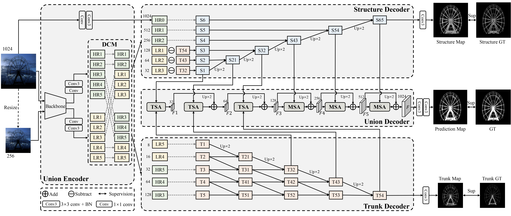

# UDUN (ACM-MM2023)



Official Implementation of ACM-MM 2023 paper "[Unite-Divide-Unite: Joint Boosting Trunk and Structure for High-accuracy Dichotomous Image Segmentation](https://arxiv.org/abs/2307.14052)"

[Jialun Pei](https://scholar.google.com/citations?user=1lPivLsAAAAJ&hl=en), Zhangjun Zhou, [Yueming Jin](https://scholar.google.com/citations?user=s_kbB4oAAAAJ&hl=zh-CN&oi=ao), [He Tang](https://scholar.google.com/citations?hl=en&user=70XLFUsAAAAJ), and [Pheng-Ann Heng](https://scholar.google.com/citations?user=OFdytjoAAAAJ&hl=zh-CN)

[[Paper]](https://arxiv.org/abs/2307.14052); [Official Version];

**Contact:** jialunpei@cuhk.edu.hk, hetang@hust.edu.cn

## Environment preparation

### Requirements
- Linux with python ≥ 3.8
- Pytorch ≥ 1.7 and torchvison that matches the Pytorch installation.
- Opencv
- Numpy
- Apex

## Dataset preparation

### Download the datasets and annotation files

- **[DIS5K](https://github.com/xuebinqin/DIS)**


### Register datasets

1. Download the datasets and put them in the same folder. To match the folder name in the dataset mappers, you'd better not change the folder names, its structure may be:

```
    DATASET_ROOT/
    ├── DIS5K
       ├── DIS-TR
          ├── im
          ├── gt
          ├── trunk-origin
          ├── struct-origin
       ├── DIS-VD
          ├── im
          ├── gt
       ├── DIS-TE1
          ├── im
          ├── gt
       ├── DIS-TE2
          ├── im
          ├── gt
       ├── DIS-TE3
          ├── im
          ├── gt
       ├── DIS-TE4
          ├── im
          ├── gt
```

## Pre-trained models
- Download the pre-training weights into UDUN-master/pre . 

| Model     | UDUN pretrain weights  | F_{\omega}   |  MAE   |  HCE   |
| :-------- |:---------------------------------------------------------|
| [ResNet-18](https://download.pytorch.org/models/resnet18-5c106cde.pth)       | [UDUN-R18](https://drive.google.com/file/d/1c_u6zw-6W9OBmefu0wiDL73IbkTitoJu/view?usp=drive_link) |   |   |    |
| [ResNet-34](https://download.pytorch.org/models/resnet34-333f7ec4.pth)      | [UDUN-R34]() |  |   |    |
| [ResNet-50](https://download.pytorch.org/models/resnet50-19c8e357.pth)    | [UDUN-R50]() |    |    |    |

Download the optimized model weights and store them in UDUN-master/model.


## Usage

### Train
- To train our UDUN on single GPU by following command,the trained models will be saved in savePath folder. You can modify datapath if you want to run your own datases.
```shell
./train.sh
```

### Test
- To test our UDUN on DIS5K, the prediction maps  will be saved in DIS5K_Pre folder.
```shell
python3 test.py 
```

### Evaluation
- To Evaluate the predicted results.
```shell
cd metrics
python3 test_metrics.py 
python3 hce_metric_main.py

```

## Visualization results

The visual results are achieved by our UDUN with ResNet-50 trained on **Overall DIS-TE**.

- Results on the Overall DIS-TE test set: [Baidu]()/
[Google]()

### Get trunk map and struct map

- Split the ground truth into trunk map and struct map, which will be saved into DIS5K-TR/gt/Trunk-origin and DIS5K-TR/gt/struct-origin.

```shell
cd utils
python3 utils.py
```

## Citation

If this helps you, please cite this work:

```
@inproceedings{pei2023udun,
  title={Unite-Divide-Unite: Joint Boosting Trunk and Structure for High-accuracy Dichotomous Image Segmentation},
  author={Pei, Jialun and Zhou, Zhangjun and Jin, Yueming and Tang, He and Pheng-Ann, Heng},
  booktitle={Proceedings of the 29th ACM International Conference on Multimedia},
  pages={1--10},
  year={2023},
}
```

